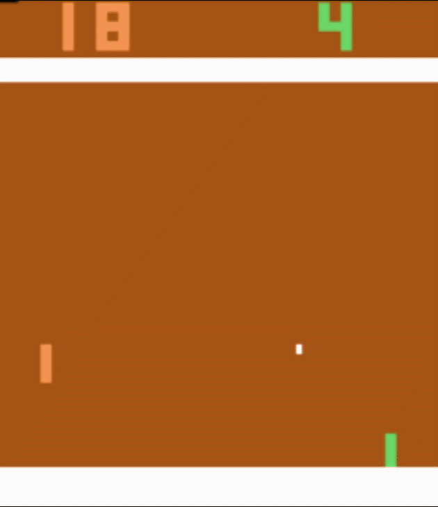

# AtariAI_Gym_PONG
This is an AI project that uses Reinforcement Learning and a Neural network to maximize score in an Atari Game called Pong





## Requirements:

To run the project you must meet this requirements:
(The following requirements are the ones used to build this project, but newer or older versions might work..)

*A virtual environment creation is suggested to avoid corrupting another versions of librarys that might be installed*

```
Tensorflow 2.2.0
numpy==1.19.3
```

Also you can install these using the command 

```
pip install -r requirements.txt
```

You will need Python 3.8 installed

### Instructions 

To run the project you might use the following command (That will start to train the AI to play pong from scratch)

```
python main.py
```

You may use the following commands with arguments to:


Start from the last checkpoint trained and not to start over from the beggining:
```
python main.py --load_checkpoint 
```

View the Ai render while the process is working:
```
python main.py --render
```

If both are required you can add the arguments next to each other:
```
python main.py --load_checkpoint --render
```

## References

* [Gym] (https://gym.openai.com/docs)
* [Gym Pong] (https://gym.openai.com/envs/Pong-v0)
* [Original Pong Project] (https://github.com/mrahtz/tensorflow-rl-pong)

## Credits

* **Elizabeth Gandara** - *Project recomendation and emotional support* - [eildgc](https://github.com/eildgc)
* **Hiram Hernandez** - *Tutoring and technical support* - [TacoPlox](https://github.com/TacoPlox)

